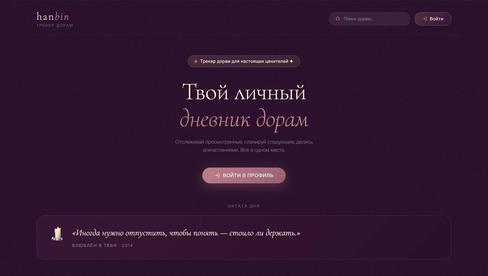

# 한빈 · Hanbin — Drama Tracker

> *Track your K-dramas and C-dramas. Feel like the main character.*

A beautifully designed SPA for tracking Korean and Chinese dramas. Built for women who are obsessed with Asian dramas and want to feel like legends about how much they've watched.


### Страница для незалогиненных пользователей



---

## ✨ Features

- **Hero stats** — total dramas, episodes, hours with animated counting
- **Currently Watching** — card view with progress bars, badges, direct watch links
- **Smart filters** — by status, genre, country
- **Card / Table view toggle**
- **Activity feed** — recent updates
- **Badges & achievements** system
- **Search** with live dropdown
- Hash-based **SPA router** — ready for new pages
- **Auth-aware routing** — при запуске показывает unauthorized страницу если пользователь не залогинен
- **Unauthorized landing page** — публичная страница с hero, цитатой дня и лентой последних дорам
- **Весь UI на русском языке**

---

## 🚀 Running Locally

The project uses ES Modules (`type="module"`), so a local server is required — opening the file directly in a browser won't work.

### Option 1 — VS Code Live Server (recommended)

1. Install the **Live Server** extension in VS Code
2. Open the project folder in VS Code
3. Right-click `pages/home.html` → **Open with Live Server**
4. Opens at `http://localhost:5500`
5. Auto-reloads on file changes ✨

To stop: click **Port: 5500** in the bottom-right corner of VS Code.

### Option 2 — Node.js

```bash
cd /Users/elenastepuro/Desktop/hanbin/hanbin-front
npx serve .
```

Opens at `http://localhost:3000`. Stop with **Ctrl+C**.

### Option 3 — Python (built into macOS)

```bash
cd /Users/elenastepuro/Desktop/hanbin/hanbin-front
python3 -m http.server 8080
```

Opens at `http://localhost:8080`. Stop with **Ctrl+C**.

---

## 📁 Project Structure

```
hanbin/
├── pages/
│   ├── home.html               # Главная страница (залогиненный)
│   ├── unauthorized.html       # Публичная страница (незалогиненный)
│   └── ...                     # новые страницы добавлять сюда
├── data/
│   └── quotes.json             # Цитаты из дорам (русский)
├── assets/
│   ├── favicon.svg
│   ├── preview.png             # Скриншот — главная (залогиненный)
│   └── preview-unauthorized.png# Скриншот — страница гостя
└── src/
    ├── app.js                  # Инициализация, инъекция стилей, unauthorizedCSS
    ├── router.js               # Hash-based SPA роутер + auth-aware redirect
    ├── styles/
    │   ├── theme.js            # ★ Все цвета, токены, шрифты — редактировать здесь
    │   └── global.js           # Базовый CSS, анимации, утилиты
    ├── api/
    │   └── mock.js             # Mock API — заменить на fetch когда будет бэкенд
    ├── components/
    │   ├── Header.js           # Поиск, переключатель вида, кнопка добавления, аватар
    │   ├── StatsBlock.js       # Герой-статистика с анимацией чисел + цитата дня
    │   ├── DramaCard.js        # Карточный вид + таблица
    │   ├── ActivityFeed.js     # Лента последних действий
    │   ├── Sidebar.js          # Статистика по странам + достижения
    │   └── Filters.js          # Панель фильтров
    ├── pages/
    │   ├── Home.js             # Главная страница — собирает все компоненты
    │   └── Unauthorized.js     # Публичная страница для гостей
    └── utils/
        └── helpers.js          # timeAgo, renderStars, statusLabel, debounce
```

---

## 🎨 Changing the Design

All visual tokens live in **`src/styles/theme.js`**:

```js
// Change the accent color across the whole app:
export const colors = {
  rose: '#c97b8a',      // ← main accent
  neonRose: '#ff6b8a',  // ← glow accent
  deepPlum: '#2d0f2a',  // ← background
  jade: '#7aab8e',      // ← "watching" status color
  warmGold: '#d4a574',  // ← "completed" + shimmer
  // ...
}
```

---

## 🔌 Connecting the Backend

All API calls are in **`src/api/mock.js`**. Each function has a `TODO` comment with the expected endpoint:

```js
// Current mock:
export async function getDramas(filters = {}) {
  await delay();
  return { data: MOCK_DRAMAS, error: null };
}

// Replace with:
export async function getDramas(filters = {}) {
  const params = new URLSearchParams(filters);
  const res = await fetch(`/api/dramas?${params}`);
  const data = await res.json();
  return { data, error: null };
}
```

---

## 🗺 Adding a New Page

1. Create `src/pages/YourPage.js`:

```js
export async function renderYourPage(container, params) {
  container.innerHTML = `<div class="container">...</div>`;
}
```

2. Register in `src/router.js`:

```js
import { renderYourPage } from './pages/YourPage.js';

const ROUTES = {
  '#/':           renderHome,
  '#/your-page':  renderYourPage,  // ← add here
};
```

3. Link to it anywhere:

```js
import { navigate } from '../router.js';
navigate('#/your-page');
```

---

## 📋 Planned Pages

| Route | Page | Status |
|---|---|---|
| `#/` | Home / Dashboard (залогиненный) | ✅ Done |
| `#/guest` | Unauthorized landing (гость) | ✅ Done |
| `#/search` | Поиск / Каталог | 🔲 TODO |
| `#/drama/:id` | Детальная страница дорамы | 🔲 TODO |
| `#/my-list` | Полный список дорам | 🔲 TODO |
| `#/profile` | Профиль пользователя | 🔲 TODO |
| `#/achievements` | Достижения и статистика | 🔲 TODO |
| `#/settings` | Настройки | 🔲 TODO |
| `#/login` | Авторизация | 🔲 TODO |

---

## 🔐 Auth-Aware Routing

При запуске приложения роутер автоматически определяет состояние авторизации:

```js
// src/router.js
if (hash === '#/' || hash === '#/home' || hash === '') {
  const { data: auth } = await getAuthState();
  if (!auth.isLoggedIn) handler = renderUnauthorized;
}
```

- **Не залогинен** → показывается `Unauthorized.js` (публичный лендинг)
- **Залогинен** → показывается `Home.js` (дашборд с личными данными)
- Все остальные маршруты (`#/search`, `#/drama/:id` и т.д.) пока не защищены — добавить guard по аналогии когда понадобится.

---

## 🌐 Unauthorized Page

Публичная страница `src/pages/Unauthorized.js` показывается незалогиненным пользователям. Состоит из:

- **Хедер** — логотип + поиск + кнопка «Войти» (вместо аватара)
- **Hero-секция** — заголовок + subtitle + CTA-кнопка «Войти в профиль»
- **Цитата дня** — из `data/quotes.json`, меняется раз в сутки (та же логика seed, что в `StatsBlock`)
- **Сетка последних дорам** — 10 дорам из `getLatestDramas()` без фильтров и личных данных
- **Login-баннер** — призыв зарегистрироваться внизу страницы

Стили для страницы живут в `unauthorizedCSS` в конце `src/app.js` и подключаются через `injectStyles()`.

---

## 🛠 Tech Stack

- Vanilla JavaScript (ES Modules, no bundler)
- No frameworks — pure DOM manipulation
- No dependencies — runs in any browser
- CSS via JS injection from `theme.js` + `global.js`
