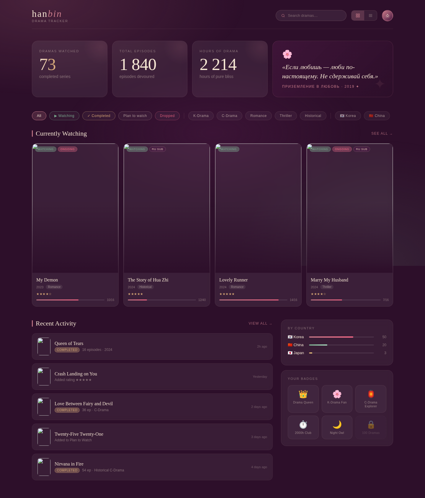

# 한빈 · Hanbin — Drama Tracker

> *Track your K-dramas and C-dramas. Feel like the main character.*

A beautifully designed SPA for tracking Korean and Chinese dramas. Built for women who are obsessed with Asian dramas and want to feel like legends about how much they've watched.



---

## ✨ Features

- **Hero stats** — total dramas, episodes, hours with animated counting
- **Currently Watching** — card view with progress bars, badges, direct watch links
- **Smart filters** — by status, genre, country
- **Card / Table view toggle**
- **Activity feed** — recent updates
- **Badges & achievements** system
- **Search** with live dropdown
- Hash-based **SPA router** — ready for new pages

---

## 🚀 Running Locally

The project uses ES Modules (`type="module"`), so a local server is required — opening the file directly in a browser won't work.

### Option 1 — VS Code Live Server (recommended)

1. Install the **Live Server** extension in VS Code
2. Open the project folder in VS Code
3. Right-click `pages/home.html` → **Open with Live Server**
4. Opens at `http://localhost:5500`
5. Auto-reloads on file changes ✨

To stop: click **Port: 5500** in the bottom-right corner of VS Code.

### Option 2 — Node.js

```bash
cd /Users/elenastepuro/Desktop/hanbin/hanbin-front
npx serve .
```

Opens at `http://localhost:3000`. Stop with **Ctrl+C**.

### Option 3 — Python (built into macOS)

```bash
cd /Users/elenastepuro/Desktop/hanbin/hanbin-front
python3 -m http.server 8080
```

Opens at `http://localhost:8080`. Stop with **Ctrl+C**.

---

## 📁 Project Structure

```
hanbin/
├── pages/
│   └── home.html               # Main page (add new pages here)
│   └── ...                     # future pages go here
├── data/
│   └── quotes.json             # Daily drama quotes (Russian)
├── assets/
│   ├── favicon.svg
│   └── preview.png             # App screenshot
└── src/
    ├── app.js                  # App init, style injection
    ├── router.js               # Hash-based SPA router
    ├── styles/
    │   ├── theme.js            # ★ ALL colors, tokens, fonts — edit here
    │   └── global.js           # Base CSS, animations, utilities
    ├── api/
    │   └── mock.js             # Mock API — replace with real fetch when backend is ready
    ├── components/
    │   ├── Header.js           # Search, view toggle, add button, avatar
    │   ├── StatsBlock.js       # Hero stats with number animation
    │   ├── DramaCard.js        # Card view + Table view
    │   ├── ActivityFeed.js     # Recent activity list
    │   ├── Sidebar.js          # Country stats + badges
    │   └── Filters.js          # Filter chips bar
    ├── pages/
    │   └── Home.js             # Home page — assembles all components
    └── utils/
        └── helpers.js          # timeAgo, renderStars, debounce, etc.
```

---

## 🎨 Changing the Design

All visual tokens live in **`src/styles/theme.js`**:

```js
// Change the accent color across the whole app:
export const colors = {
  rose: '#c97b8a',      // ← main accent
  neonRose: '#ff6b8a',  // ← glow accent
  deepPlum: '#2d0f2a',  // ← background
  jade: '#7aab8e',      // ← "watching" status color
  warmGold: '#d4a574',  // ← "completed" + shimmer
  // ...
}
```

---

## 🔌 Connecting the Backend

All API calls are in **`src/api/mock.js`**. Each function has a `TODO` comment with the expected endpoint:

```js
// Current mock:
export async function getDramas(filters = {}) {
  await delay();
  return { data: MOCK_DRAMAS, error: null };
}

// Replace with:
export async function getDramas(filters = {}) {
  const params = new URLSearchParams(filters);
  const res = await fetch(`/api/dramas?${params}`);
  const data = await res.json();
  return { data, error: null };
}
```

---

## 🗺 Adding a New Page

1. Create `src/pages/YourPage.js`:

```js
export async function renderYourPage(container, params) {
  container.innerHTML = `<div class="container">...</div>`;
}
```

2. Register in `src/router.js`:

```js
import { renderYourPage } from './pages/YourPage.js';

const ROUTES = {
  '#/':           renderHome,
  '#/your-page':  renderYourPage,  // ← add here
};
```

3. Link to it anywhere:

```js
import { navigate } from '../router.js';
navigate('#/your-page');
```

---

## 📋 Planned Pages

| Route | Page | Status |
|---|---|---|
| `#/` | Home / Dashboard | ✅ Done |
| `#/search` | Discover / Search | 🔲 TODO |
| `#/drama/:id` | Drama Detail | 🔲 TODO |
| `#/my-list` | Full drama list | 🔲 TODO |
| `#/profile` | User profile | 🔲 TODO |
| `#/achievements` | Badges & stats | 🔲 TODO |
| `#/settings` | Settings | 🔲 TODO |

---

## 🛠 Tech Stack

- Vanilla JavaScript (ES Modules, no bundler)
- No frameworks — pure DOM manipulation
- No dependencies — runs in any browser
- CSS via JS injection from `theme.js` + `global.js`
