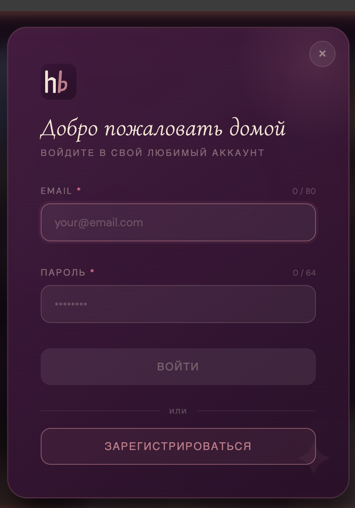
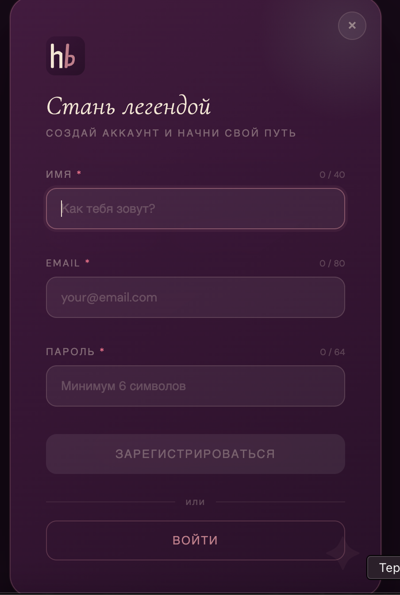

# 한빈 · Hanbin — Drama Tracker

> *Track your K-dramas and C-dramas. Feel like the main character.*

A beautifully designed SPA for tracking Korean and Chinese dramas. Built for women who are obsessed with Asian dramas and want to feel like legends about how much they've watched.

---

## 📸 Screenshots

### Главная страница (залогиненный)


### Страница гостя — Hero


### Раздел «Тебе понравится»


### Модалка логина


### Модалка регистрации


---

## ✨ Features

- **Hero stats** — total dramas, episodes, hours with animated counting
- **Currently Watching** — card view with progress bars, badges, direct watch links
- **Smart filters** — by status, genre, country
- **Card / Table view toggle**
- **Activity feed** — recent updates
- **Badges & achievements** system
- **Search** with live dropdown
- Hash-based **SPA router** — ready for new pages
- **Auth-aware routing** — при запуске показывает unauthorized страницу если пользователь не залогинен
- **Unauthorized landing page** — публичная страница с hero, цитатой дня, разделом «Тебе понравится» и баннером входа
- **«Тебе понравится»** — живая лента из 10 дорам, парсится с [doramatv.one](https://m.doramatv.one/) через CORS-прокси; показывает рейтинг ★, жанр и статус прямо на постере
- **Модалка логина** — email + пароль, плавный переход к регистрации без пересоздания оверлея
- **Модалка регистрации** — имя + email + пароль, валидация, плавный переход обратно к логину
- **Весь UI на русском языке**

---

## 🚀 Running Locally

The project uses ES Modules (`type="module"`), so a local server is required.

### Option 1 — Node.js (recommended)

```bash
cd /Users/elenastepuro/Desktop/hanbin/hanbin-front
npx serve .
```

Opens at `http://localhost:3000`. Stop with **Ctrl+C**.

### Option 2 — VS Code Live Server

1. Install the **Live Server** extension in VS Code
2. Right-click `pages/home.html` → **Open with Live Server**
4. Opens at `http://localhost:5500`

### Option 3 — Python

```bash
python3 -m http.server 8080
```

---

## 📁 Project Structure

```
hanbin/
├── pages/
│   └── home.html               # Единственный HTML файл — точка входа SPA
├── data/
│   └── quotes.json             # Цитаты из дорам (русский)
├── assets/
│   ├── favicon.svg
│   ├── preview.png                   # Скриншот — главная (залогиненный)
│   ├── preview-unauthorized.png      # Скриншот — hero-секция гостя
│   ├── preview-you-might-like.png    # Скриншот — раздел «Тебе понравится»
│   ├── preview-login-modal.png       # Скриншот — модалка логина
│   └── preview-register-modal.png    # Скриншот — модалка регистрации
└── src/
    ├── app.js                  # Инициализация, инъекция стилей, componentCSS + unauthorizedCSS
    ├── router.js               # Hash-based SPA роутер + auth-aware redirect
    ├── styles/
    │   ├── theme.js            # ★ Все цвета, токены, шрифты — редактировать здесь
    │   └── global.js           # Базовый CSS, анимации, утилиты
    ├── api/
    │   └── mock.js             # Mock API — заменить на fetch когда будет бэкенд
    ├── components/
    │   ├── Header.js           # Поиск, переключатель вида, кнопка добавления, аватар
    │   ├── StatsBlock.js       # Герой-статистика с анимацией чисел + цитата дня
    │   ├── DramaCard.js        # Карточный вид + таблица
    │   ├── ActivityFeed.js     # Лента последних действий
    │   ├── Sidebar.js          # Статистика по странам + достижения
    │   ├── Filters.js          # Панель фильтров
    │   ├── LoginModal.js       # Модалка авторизации — единый оверлей, слайд-переходы
    │   └── RegisterModal.js    # Модалка регистрации — монтируется внутри того же оверлея
    ├── pages/
    │   ├── Home.js             # Главная страница — собирает все компоненты
    │   └── Unauthorized.js     # Публичная страница для гостей
    └── utils/
        └── helpers.js          # timeAgo, renderStars, statusLabel, debounce
```

---

## 🌐 Unauthorized Page

Публичная страница `src/pages/Unauthorized.js` показывается незалогиненным пользователям.

| Секция | Описание |
|---|---|
| **Хедер** | Логотип + поиск + кнопка «Войти» (открывает модалку) |
| **Hero** | Заголовок «Твой личный дневник дорам» + CTA-кнопка |
| **Цитата дня** | Из `data/quotes.json`, меняется раз в сутки |
| **Тебе понравится** | 10 дорам с doramatv.one — постер, рейтинг ★, жанр, статус |
| **Login-баннер** | Призыв войти в профиль в нижней части страницы |

Стили живут в `unauthorizedCSS` в `src/app.js`.

---

## 🎬 «Тебе понравится» — как работает

Парсит секцию «Горячие новинки» с [m.doramatv.one](https://m.doramatv.one/) через `corsproxy.io`:

```
fetchHotDramas()
  └─ fetch(corsproxy.io + m.doramatv.one)
  └─ DOMParser → section[data-tab-text="Горячие новинки"]
  └─ .entity-card-tile × 10
      ├─ title  (.entity-card-tile__title)
      ├─ cover  (img[data-original])
      ├─ rating (.compact-rate[title])
      ├─ genres (.elem_genre)
      └─ status ("выходит" / "аирится" → badge «Выходит»)
```

При ошибке показывается сообщение + прямая ссылка на сайт.
Клик по карточке — открывает страницу дорамы в новой вкладке.

---

## 🔐 Auth Modals — Login & Register

### Архитектура

Обе модалки работают через **один общий оверлей** (`#hb-modal-overlay`). При переходе между ними оверлей и фон остаются на месте — меняется только контент внутри `#hb-modal-content`. Это исключает моргание фона.

```
#hb-modal-overlay   ← создаётся один раз, не удаляется при переходах
  └─ #hb-modal-box  ← карточка модалки
       └─ #hb-modal-content  ← сюда монтируется loginContent или registerContent
```

### Анимация переходов

| Переход | Старый контент | Новый контент |
|---|---|---|
| Логин → Регистрация | slide-out влево (220ms) | slide-in справа (280ms) |
| Регистрация → Логин | slide-out вправо (220ms) | slide-in слева (280ms) |
| Открытие модалки | — | slideUp + scale (320ms) |
| Закрытие | fade-out (220ms) | — |

### API

```js
// Открыть логин
import { openLoginModal } from '../components/LoginModal.js';
openLoginModal();

// Открыть регистрацию напрямую
import { openRegisterModal } from '../components/RegisterModal.js';
openRegisterModal();

// Закрыть текущую модалку (с анимацией)
import { closeModal } from '../components/LoginModal.js';
closeModal();
```

### Поля и валидация

**Логин:** Email (maxlength 80) + Пароль (maxlength 64)
- Кнопка «Войти» активна только когда оба поля заполнены
- Валидация email по regex

**Регистрация:** Имя (maxlength 40) + Email (maxlength 80) + Пароль (maxlength 64)
- Кнопка «Зарегистрироваться» активна только когда все три поля заполнены
- Имя ≥ 2 символов, email по regex, пароль ≥ 6 символов
- Счётчик символов у каждого поля

### Закрытие

| Действие | Логин | Регистрация |
|---|---|---|
| Крестик × | Остаётся на текущей странице | Переход на `#/guest` |
| Клик на оверлей | Остаётся на текущей странице | Переход на `#/guest` |
| Escape | Остаётся на текущей странице | Переход на `#/guest` |

### Backend integration TODO

```js
// LoginModal.js — validateAndLogin():
const res = await fetch('/api/auth/login', {
  method: 'POST',
  headers: { 'Content-Type': 'application/json' },
  body: JSON.stringify({ email, password })
});
const { token, user } = await res.json();
localStorage.setItem('hanbin_user', JSON.stringify(user));
closeModal();
navigate('#/');

// RegisterModal.js — validateAndRegister():
const res = await fetch('/api/auth/register', {
  method: 'POST',
  headers: { 'Content-Type': 'application/json' },
  body: JSON.stringify({ name, email, password })
});
const { token, user } = await res.json();
localStorage.setItem('hanbin_user', JSON.stringify(user));
closeModal();
navigate('#/');
```

---

## 🔌 Auth-Aware Routing

```js
// src/router.js
if (hash === '#/' || hash === '') {
  const { data: auth } = await getAuthState();
  if (!auth.isLoggedIn) handler = renderUnauthorized;
}
```

- **Не залогинен** → `Unauthorized.js`
- **Залогинен** → `Home.js`

Чтобы залогиниться для тестирования:
```js
// В консоли браузера:
localStorage.setItem('hanbin_user', JSON.stringify({ id: 'user_001', name: 'Elena' }))
// Разлогиниться:
localStorage.removeItem('hanbin_user')
```

---

## 🎨 Changing the Design

All visual tokens live in **`src/styles/theme.js`**:

```js
export const colors = {
  rose: '#c97b8a',      // ← main accent
  neonRose: '#ff6b8a',  // ← glow accent
  deepPlum: '#2d0f2a',  // ← background
  jade: '#7aab8e',      // ← "watching" status
  warmGold: '#d4a574',  // ← "completed" + shimmer + rating stars
}
```

---

## 🔌 Connecting the Backend

All API calls are in **`src/api/mock.js`**:

```js
// Replace mock with real fetch:
export async function getDramas(filters = {}) {
  const params = new URLSearchParams(filters);
  const res = await fetch(`/api/dramas?${params}`);
  const data = await res.json();
  return { data, error: null };
}
```

---

## 📋 Planned Pages

| Route | Page | Status |
|---|---|---|
| `#/` | Home / Dashboard (залогиненный) | ✅ Done |
| `#/guest` | Unauthorized landing (гость) | ✅ Done |
| `#/register` | Регистрация | ✅ Done (модалка) |
| `#/search` | Поиск / Каталог | 🔲 TODO |
| `#/drama/:id` | Детальная страница дорамы | 🔲 TODO |
| `#/my-list` | Полный список дорам | 🔲 TODO |
| `#/profile` | Профиль пользователя | 🔲 TODO |
| `#/achievements` | Достижения и статистика | 🔲 TODO |
| `#/settings` | Настройки | 🔲 TODO |

---

## 🛠 Tech Stack

- Vanilla JavaScript (ES Modules, no bundler)
- No frameworks — pure DOM manipulation
- No dependencies — runs in any browser
- CSS via JS injection from `theme.js` + `global.js`
